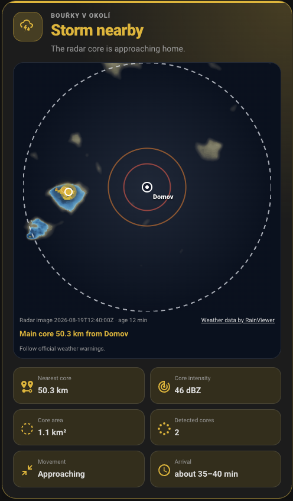
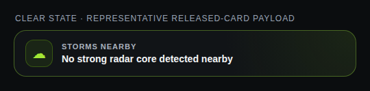
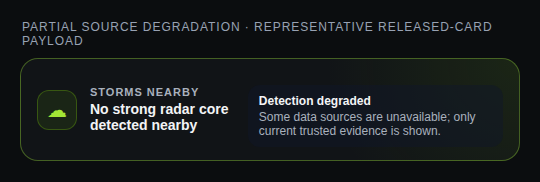

# Storm Detector

A Home Assistant integration that monitors **nearby thunderstorms and possible hail**.

It combines RainViewer radar with optional Home Assistant lightning sensors. The integration only reports possible hail when current radar data supports that conclusion; lightning alone is shown as a nearby thunderstorm, never as hail.

[](https://my.home-assistant.io/redirect/hacs_repository/?owner=petrvnk&repository=storm-detector&category=integration)

## What it does

- Detects nearby radar storm cores.
- Distinguishes a storm, lightning-only activity, and radar-supported possible hail.
- Estimates direction and arrival time when recent radar frames support a reliable estimate.
- Hides stale values and reports unavailable data instead of presenting an old event as current.
- Provides a compact adaptive Lovelace card and an optional notification blueprint.

| Evidence | User-facing meaning |
|---|---|
| `none` | No significant current activity |
| `radar_storm` | Storm core nearby |
| `lightning_only` | Thunderstorm / lightning nearby; follow official weather warnings |
| `radar_hail` | Radar indicates possible hail |
| `radar_hail_with_lightning` | Possible hail with nearby lightning |
| `unavailable` | Current detection data is unavailable |

Storm Detector is heuristic only. It does not detect hail on the ground and does not provide a calibrated hail probability.

## Screenshots

The first screenshot was supplied from a live Storm Detector card. Its timestamp and weather values describe only the moment of capture, not current conditions. It contains no exact location or entity identifiers.

### Live storm activity



### Representative comparison states

The following screenshots use representative coordinator payloads rendered by the released card.

| Clear | Partial source degradation |
|---|---|
|  |  |

## Install with HACS

Minimum Home Assistant version: **2024.10.0**.

Storm Detector is currently installed as a **HACS custom repository**. Use normal HACS search only after this repository is accepted into the HACS default catalog.

1. Use the **Open your Home Assistant** button above, or open **HACS → Integrations**.
2. For manual HACS setup, open **Custom repositories** and add `https://github.com/petrvnk/storm-detector` as category **Integration**.
3. Install the latest released version of **Storm Detector**.
4. Restart Home Assistant.
5. Go to **Settings → Devices & services → Add integration** and select **Storm Detector**.

### Manual installation

1. Download the source archive for the latest GitHub release.
2. Copy `custom_components/storm_detector/` into `<HA config>/custom_components/`.
3. Restart Home Assistant.
4. Add **Storm Detector** from **Settings → Devices & services**.

## Upgrade

1. Install the available Storm Detector update in HACS.
2. Restart Home Assistant when HACS requests it.
3. Verify that the Storm Detector entities are available and `binary_sensor.storm_detector_data_stale` is `off` under normal source conditions.
4. If the custom card still shows old copy or layout, reload the dashboard and clear the Home Assistant frontend cache for that browser or app.

Do not copy files from the default branch over a released installation. HACS releases are the supported upgrade path.

## Uninstall

1. Remove or replace dashboards and automations that reference Storm Detector entities or `custom:storm-detector-card`.
2. Delete the Storm Detector integration entry under **Settings → Devices & services**.
3. Remove Storm Detector in HACS, then restart Home Assistant.
4. Remove `/storm_detector/storm-detector-card.js` from **Settings → Dashboards → Resources** if you added it manually and no other dashboard uses it.

Never edit Home Assistant `.storage` files for a normal uninstall.

## Setup

The initial setup has only three optional fields:

- **Location** — leave empty to use Home Assistant's configured coordinates, or select a `zone`, `person`, or `device_tracker` with latitude and longitude.
- **Lightning distance sensor** — optional distance sensor from a Blitzortung-compatible or similar integration.
- **Lightning counter sensor** — optional matching strike counter.

For radar-only mode, leave both lightning fields empty. If lightning is enabled, configure both distance and counter sensors.

The integration tries to detect compatible lightning sensors automatically. Open **Configure → Options** only when you need to change the analysis radius, radar thresholds, distance thresholds, frame count, refresh interval, stale timeout, or optional lightning azimuth. The defaults are intended to be a safe starting point.

Open-Meteo is intentionally **not** part of the detection path.

## Main entities

| Entity | Purpose |
|---|---|
| `sensor.storm_detector_level` | `none`, `watch`, `warning`, `urgent`, or `unavailable` |
| `sensor.storm_detector_summary` | Short human-readable status |
| `binary_sensor.storm_detector_active` | Current storm or warning is active |
| `binary_sensor.storm_detector_data_stale` | Source data is no longer current |

These four entities are enabled by default. Detailed radar, lightning, frame-age, and storm-core entities are disabled by default and can be enabled for diagnostics.

For automations, use the `evidence_kind` attribute on the level sensor instead of parsing the summary text.

## Lovelace dashboard snippets

Dashboard files are **manual examples only**; the integration never writes dashboards automatically.

Recommended ready-made example: [`examples/lovelace/native-card.yaml`](examples/lovelace/native-card.yaml). Additional examples are available in [`examples/lovelace/`](examples/lovelace/).

### Adaptive custom card

Add this JavaScript resource in **Settings → Dashboards → Resources**:

```text
URL: /storm_detector/storm-detector-card.js
Type: JavaScript module
```

Then add a manual card:

```yaml
type: custom:storm-detector-card
radar_overlay: auto
```

`radar_overlay` controls the live RainViewer layer:

- `auto` (default) shows it only for current radar-supported storm or hail activity.
- `off` always uses the schematic radar view.
- `always` shows a valid current radar layer even without a detected core; stale or unavailable data still stays hidden.

The card is non-interactive: it has no pan, zoom, playback, or hover-only details. If RainViewer tiles are unavailable or blocked, the card falls back to its schematic radar view without changing the reported risk state.

## Notification blueprint

[](https://my.home-assistant.io/redirect/blueprint_import/?blueprint_url=https%3A%2F%2Fgithub.com%2Fpetrvnk%2Fstorm-detector%2Fblob%2Fv0.2.1%2Fblueprints%2Fautomation%2Fstorm_detector%2Fstorm_notification.yaml)

The optional blueprint is located at [`blueprints/automation/storm_detector/storm_notification.yaml`](blueprints/automation/storm_detector/storm_notification.yaml). The button imports the blueprint from the immutable `v0.2.1` release tag. Import it, create an automation, and select the level sensor, a notify service, minimum level, title language, and cooldown.

The blueprint is opt-in and does not create automations by itself. Its evidence-aware Czech wording distinguishes:

- **Sledování bouřky**;
- **Blízká bouřka / blesky poblíž**;
- **Možné kroupy poblíž**;
- **Vysoká možnost krup**.

## Privacy and data flow

Storm Detector has no project-operated cloud service, account, telemetry, or analytics.

- The backend sends requests to RainViewer for public radar metadata and image tiles required for the configured monitored area.
- The optional live card sends tile-image requests directly from the viewing browser or Home Assistant app to RainViewer.
- Tile coordinates can reveal the approximate monitored map area to RainViewer and to normal network intermediaries. Exact Home Assistant coordinates are not intentionally included as query parameters.
- Optional lightning entity states are read locally from Home Assistant and are not sent by Storm Detector to a project-operated server.
- Configuration and computed state remain in Home Assistant. Generated diagnostics intentionally omit configured coordinates and entity IDs, but review every attachment before publishing it.

The backend caches RainViewer metadata for about five minutes and keeps a bounded in-memory cache of successful frame analyses. An unchanged radar window is not downloaded repeatedly; transient failures use jittered retries and bounded cooldowns, including `Retry-After` handling.

The repository's MIT license covers the integration code, not RainViewer radar data. RainViewer terms, attribution, and availability remain separate. The live radar module keeps a visible localized RainViewer attribution link.

## Troubleshooting

### The card is not found

Confirm that `/storm_detector/storm-detector-card.js` is registered as a JavaScript module, restart Home Assistant after installing the integration, then reload the dashboard frontend.

### The card still shows an old version

Confirm the installed Storm Detector version in HACS, restart Home Assistant, and clear the frontend cache in the affected browser or companion app. Do not repeatedly reinstall the default branch.

### Detection is degraded or stale

Inspect `source_status`, `degradation_reasons`, `last_error`, and `is_stale` on `sensor.storm_detector_level`. A quiet event-driven lightning source with distance `unknown` and counter `0` is normal; genuinely missing, invalid, or unavailable entities should degrade the source.

### Radar is unavailable

Check general network access to RainViewer and wait for the bounded retry cooldown. Storm Detector preserves current trusted evidence but does not treat old radar data as current.

For reproducible problems, open a bug report and attach reviewed Home Assistant diagnostics without private entity names, addresses, tokens, or raw logs containing identifying data.

## Support and security

- Usage questions and troubleshooting: [`SUPPORT.md`](SUPPORT.md)
- Bug reports and feature requests: [GitHub Issues](https://github.com/petrvnk/storm-detector/issues)
- Security vulnerabilities: [`SECURITY.md`](SECURITY.md)
- Contributions: [`CONTRIBUTING.md`](CONTRIBUTING.md)

## Limitations

- Storm Detector is **not an official warning source**.
- Radar and lightning feeds can be delayed, unavailable, or inaccurate.
- Radar reflectivity can overestimate or miss local hail conditions.
- Do not use it as the only input for safety-critical automation.
- Keep official weather warnings and local safety guidance as the authority.

## Credits

- Radar data: [RainViewer](https://www.rainviewer.com/api.html)
- Optional lightning context: Home Assistant sensors from Blitzortung-compatible integrations
- Platform: [Home Assistant](https://www.home-assistant.io/) and [HACS](https://www.hacs.xyz/)

Development and release checks are documented in [`docs/release-checklist.md`](docs/release-checklist.md).
